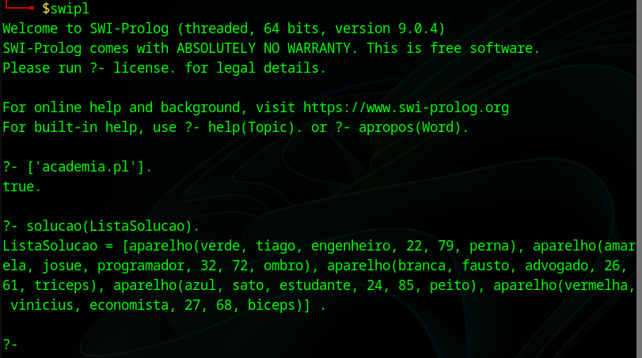
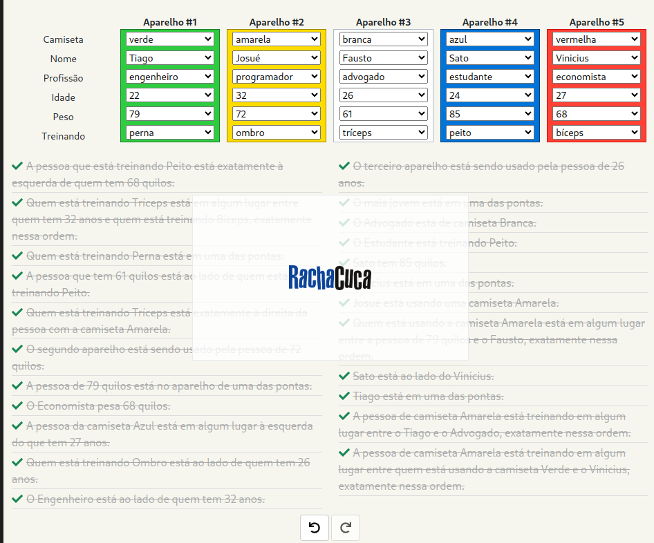

# Rachando a Cuca com Prolog: Colegas na Academia


**Disciplina:** INE5633 - Sistemas Inteligentes  
**Curso:** Sistemas de Informação  
**Graduando:** Rudolfo Lange Neto  
**Universidade Federal de Santa Catarina (UFSC)**


## Índice

- [Enunciado do Problema](#enunciado-do-problema)
- [Sobre o Prolog](#sobre-o-prolog)
  - [Por que Prolog?](#por-que-prolog)
- [Como o Código Resolve o Problema](#como-o-código-resolve-o-problema)
- [Como Executar o Código no Linux (Debian/Ubuntu)](#como-executar-o-código-no-linux-debianubuntu)
  - [Passo 1: Instalar o SWI-Prolog](#passo-1-instalar-o-swi-prolog)
  - [Passo 2: Clonar o Repositório](#passo-2-clonar-o-repositório)
  - [Passo 3: Executar o Prolog](#passo-3-executar-o-prolog)
  - [Passo 4: Consultar a Solução](#passo-4-consultar-a-solução)
  - [Passo 5: Visualizar o Resultado no Racha Cuca](#passo-5-visualizar-o-resultado-no-racha-cuca)
- [Terminal](#terminal)
- [Resultado no Racha Cuca](#resultado-no-racha-cuca)


## Enunciado do Problema
Cinco colegas estão na academia fazendo musculação. Cada um deles está utilizando um aparelho para exercitar um grupo muscular, sendo que os cinco aparelhos estão lado a lado. Observe as dicas e use o raciocínio lógico para associar uma cor de camiseta, um nome, uma profissão, um peso e um treinamento para cada um deles.

Fonte: [Racha Cuca - Colegas na Academia](https://rachacuca.com.br/logica/problemas/colegas-na-academia/)

## Sobre o Prolog
Prolog é uma linguagem de programação lógica amplamente utilizada em sistemas de inteligência artificial e bancos de dados inteligentes. Baseado no paradigma de programação declarativa, o Prolog permite a representação de fatos e regras que descrevem relações lógicas, facilitando a resolução de problemas complexos por meio de inferência lógica.

### Por que Prolog?

- **Paradigma Declarativo:** Ao contrário de linguagens imperativas como Python, onde o programador define passo a passo como resolver o problema, Prolog permite que o programador defina **o que** o problema é. Isso simplifica a modelagem de problemas complexos, como quebra-cabeças lógicos, onde as relações entre os elementos são mais facilmente expressas de forma declarativa.

- **Inferência e Backtracking:** Prolog possui mecanismos internos de **inferência lógica** e **backtracking**, que exploram automaticamente todas as possíveis combinações para encontrar soluções que satisfazem as restrições definidas. Em Python, implementar esses mecanismos manualmente pode ser complexo e propenso a erros, exigindo mais código e tempo de desenvolvimento.

- **Expressividade e Concisão:** Prolog permite expressar regras e relações de maneira mais concisa e legível. Problemas que demandariam várias linhas de código em Python podem ser resolvidos com poucas declarações em Prolog, tornando o código mais fácil de entender e manter.

- **Facilidade de Manutenção e Escalabilidade:** Em Prolog, adicionar novas regras ou modificar existentes é mais direto, pois a lógica é centralizada nas declarações de fatos e regras. Em Python, mudanças podem exigir revisões em múltiplas partes do código, aumentando a complexidade da manutenção.

## Como o Código Resolve o Problema
O código Prolog modela o problema utilizando fatos que representam as possíveis profissões, treinamentos, cores de camiseta, nomes, pesos e idades dos cinco colegas. As regras implementam as restrições fornecidas no enunciado para garantir que cada atributo seja único e corretamente associado a cada colega.

Prolog utiliza uma estratégia de **busca em profundidade** (Depth-First Search) combinada com **backtracking** para explorar todas as possíveis combinações que satisfazem as restrições impostas. Ao definir claramente as relações e restrições, Prolog automaticamente infere a solução correta sem a necessidade de programação imperativa detalhada. Isso torna o processo de resolução mais eficiente e menos sujeito a erros comparado a uma implementação equivalente em Python, onde tais mecanismos teriam que ser manualmente implementados.


## Como Executar o Código no Linux (Debian/Ubuntu)

### Passo 1: Instalar o SWI-Prolog
Caso ainda não tenha o SWI-Prolog instalado, siga os passos abaixo:

Abra o terminal e execute:

```bash
sudo apt-get update
sudo apt-get install swi-prolog
```

### Passo 2: Clonar o Repositório
Clone este repositório para o seu computador:

```bash
git clone https://github.com/rlneto/academia_prolog.git
cd academia_prolog
```

### Passo 3: Executar o Prolog
Inicie o SWI-Prolog no terminal:


```bash
swipl
```

### Passo 4: Consultar a Solução
No prompt do Prolog (?-), execute a consulta para encontrar a solução do problema:

```prolog
?- ['academia.pl'].
?- solucao(ListaSolucao).
```

### Passo 5: Visualizar o Resultado no Racha Cuca
Após obter a solução no terminal, você pode validar a correspondência no [Racha Cuca](https://rachacuca.com.br/logica/problemas/colegas-na-academia/).


Terminal



Resultado no Racha Cuca




